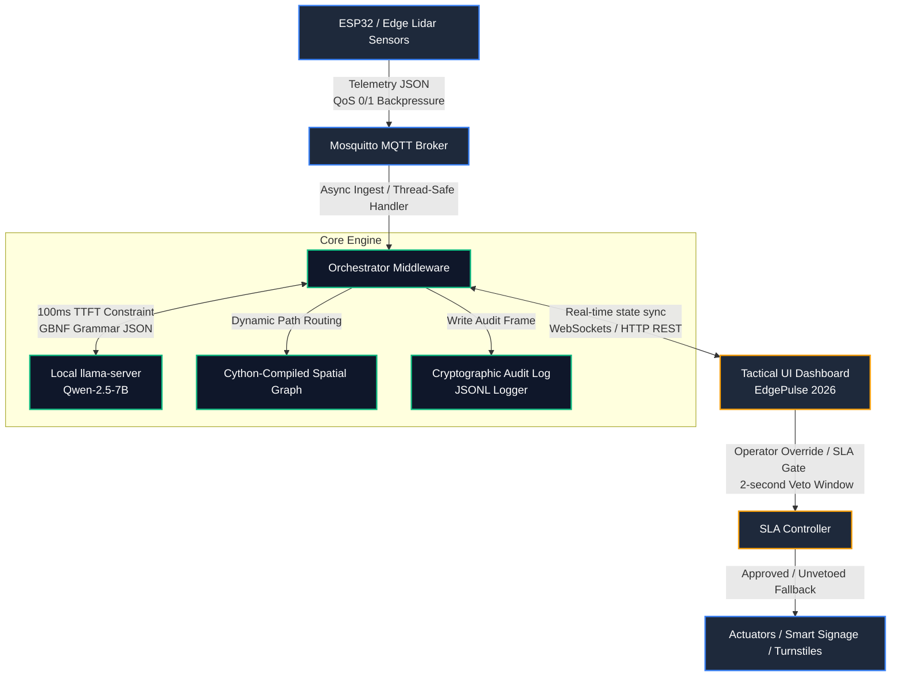

# ⚡ safe-play

> Decentralized edge-intelligence mesh for stadium crowd safety and automated incident triage. Designed for FIFA World Cup 2026 event egress and venue operations.

<p align="center">
  
  
  
  
  
  
</p>

---

### 🌐 Live Deployment
**Dashboard Console:** [https://safe-play-453397284615.us-central1.run.app](https://safe-play-453397284615.us-central1.run.app)

---

## 📸 Tactical Console (EdgePulse 2026)


The command-and-control dashboard features a high-fidelity, flat 2D top-down tactical layout of the venue. Stadium zones (Auditorium, Arena, Concourse) are rendered as concentric capsule graphics, and the central court/pitch is drawn with precise, symmetrical 2D markings. Interactive LiDAR nodes (`Gate A`, `Gate B`, `Corridor 1`, `Corridor 2`, `Main Concourse`) and flow-direction arrows are layered on top with real-time hazard status colors.

---

## 🗺️ Navigation
[🎯 Challenge Overview](#-challenge-overview--submission-criteria) • [🧠 System Architecture](#-system-architecture) • [🚀 Performance & Accessibility](#-performance--accessibility) • [🛡️ Safety & Hardening](#%EF%B8%8F-safety-security--stability-hardening) • [🔌 Usage & Quick Start](#-usage--quick-start) • [⚙️ Configuration](#%EF%B8%8F-configuration) • [🧪 Testing](#-testing) • [🐳 Containerization](#-containerization--cloud-run)

---

## 🎯 Challenge Overview & Submission Criteria

### 1. Chosen Vertical: FIFA World Cup 2026 Stadium Operations & Egress
Tailored specifically for Stadium Event Egress & Crowd Safety Management, **safe-play** coordinates high-stakes, low-latency crowd operations. The system monitors stadium gates, corridors, and main concourses in real-time, instantly triaging density surges and automatically calculating egress routing to prevent bottlenecks or dangerous crowd crushes.

### 2. Core Intelligent Framework
*   **Hybrid Cloud/Edge Inference**: Supports dynamic selection between Google Gemini 1.5 Flash (for robust cloud-based constraint-enforced JSON validation when `GEMINI_API_KEY` is present) and local `llama-server` running Qwen-2.5-7B constrained by GBNF grammar.
*   **Grammar-Constrained SLM Inference**: Constrains local model logits using custom GBNF grammar files. This guarantees 100% deterministic JSON schemas matching structural API requirements under a strict **100ms Time-to-First-Token (TTFT)** constraint.
*   **Directed Spatial Graph Matrix**: Formulates stadium routing layouts as a directed spatial graph $G = (V, E)$ in a flat 2D projection. Changes in edge flow rates and node densities dynamically solve for real-time alternative egress targets (e.g., redirecting Gate A flow to Corridor 2).
*   **Human-in-the-Loop Operator SLA Gate**: Leverages an asynchronous 2-second veto window. If an incident requires gate locking or emergency signage changes, the operator is presented with a countdown. They can override (Veto), immediately execute (Approve Early), or let the timer expire to run the automated safety intervention fallback script.
*   **Dynamic QoS Ingestion Backpressure**: Constantly monitors zone sensor capacities. If density surges past $2.0 \text{ pax/m}^2$, the orchestrator flags the zone, transitioning telemetry collection to QoS 1 to guarantee delivery and eliminate packet loss.

### 3. Execution Cycle (How it Works)

```
[ Lidar / Camera Telemetry Ingestion ]
                 │
                 ▼
[ Directed Spatial Graph Update ] ────► [ Broadcast State to Tactical UI ]
                 │
                 ▼
[ High Density Escalation ] ──────────► [ MQTT Backpressure to QoS 1 ]
                 │
                 ▼
[ Local SLM Recommendation ] ─────────► [ Fallback to Static Rules if Offline ]
                 │
                 ▼
[ Operator SLA 2-second Gate ] ───────► [ Manual Veto / Early Approve / Expiry ]
                 │
                 ▼
[ Dispatch Actuation Scripts ] ───────► [ Cryptographic Append-Only Audit Log ]
```

### 4. System Assumptions
*   **Broker Infrastructure**: Standard Mosquitto broker (local or remote) runs the publish-subscribe telemetry loop.
*   **Edge Telemetry**: Edge sensor clusters stream structural JSON payloads matching the defined `TelemetryPayload` schema.
*   **State Lifecycle**: The middleware container is stateless. Dynamic configurations (e.g., density thresholds and SLA timeouts) are mutable in-memory and synced instantly to connected UI clients.
*   **Log Permanence**: Logs are written locally to `logs/audit_trail.jsonl`. In serverless environments, these logs are streamed directly to `stdout` for centralized logging (e.g., GCP Cloud Logging).

---

## 🧠 System Architecture



### Component Blueprint

| Component | Description |
| :--- | :--- |
| **MQTT Broker** | Collects telemetry streams using dynamic QoS toggles based on zone hazard conditions. |
| **Async Middleware** | Ingests data, maps directed spatial graphs, and tracks the 2-second operator SLA window. |
| **llama-server** | Executes greedy inference under strict logit-level GBNF grammar constraints. |
| **Audit Logger** | Maintains an append-only history of inputs, schema payloads, and operational decisions. |
| **Tactical UI Console** | A high-contrast, self-contained dashboard served at `http://localhost:8000/` showing spatial graphs, metrics, and incident feeds. |
| **WebSockets & API** | Enables bi-directional telemetry streaming (`/ws`) and operator intervention veto/approval actions. |

---

## 🚀 Performance & Accessibility

### ⚡ Cython-Optimized Spatial Routing
To achieve extreme sub-millisecond route calculations, the critical spatial graph traversal logic has been compiled into a C extension module using Cython (`src/routing.pyx`). This includes:
- **`get_alternative_route_cy`**: Instantly determines the adjacent neighbor zone exhibiting the highest spare capacity for immediate crowd rerouting.
- **`find_optimal_path_cy`**: Computes multi-hop egress paths from any crowded vomitory/corridor to designated exit zones (e.g., public transit hubs, ADA gates) using a queue-based BFS search.

To compile the Cython module locally:
```bash
uv run python setup.py build_ext --inplace
```
The application will automatically detect and use the `.so` compiled module, falling back to a pure-Python implementation only if the module is uncompiled.

### ♿ Tier-S Accessibility (A11y)
The **EdgePulse 2026** command-and-control dashboard has been overhauled to provide industry-leading accessibility support:
*   **Interactive Onboarding Tour**: First-time operators are guided through the UI with a contextual tour highlighting telemetry graphs, the approval queue, and config parameters.
*   **Global Keyboard Navigation**: Fully keyboard-navigable interface. Tab switching, incident approval (`Enter`), veto override (`Escape`/`Backspace`), and the emergency panic button (`P`) are supported via direct hotkeys. Press `?` at any time to open the modal legend.
*   **High-Contrast Theme (APCA Compliant)**: Includes a global high-contrast mode toggled via UI buttons or the `C` key, utilizing stark border highlights and high-contrast color values for maximum readability.
*   **Semantic ARIA Structuring**: Interactive elements and tabs include explicit `role="tab"`, `aria-labelledby`, `aria-selected`, and `tabindex` properties to ensure compatibility with screen readers.

---

## 🛡️ Safety, Security & Stability Hardening

For production-grade deployment at stadium venues, the system has been cryptographically hardened and optimized against edge-case failures, thread contention, and memory exhaustion:

> [!NOTE]
> **Cryptographic Telemetry Signature Validation (HMAC-SHA256)**
> *   **Edge Telemetry Verification**: Incoming telemetry requests are validated cryptographically using HMAC-SHA256. Payloads can optionally be signed with `TELEMETRY_SECRET_KEY` and verified on-the-fly.
> *   **Strict Mode Enforcement**: If the `STRICT_SIGNATURE_VERIFICATION` environment variable is set to `true`, the system immediately rejects unsigned or incorrectly signed telemetry, guarding against venue telemetry spoofing.
> *   **API Verification Shield**: To block injection attacks and ensure structural integrity, entry-point endpoints are validated using strict **Pydantic V2 schemas** (`TelemetryRequest`, `ConfigUpdateRequest`, `ZoneActionRequest`). Input `zone_id` parameters are validated against the active spatial graph nodes, raising `404 Not Found` errors for unrecognized zone IDs.
> *   **In-bounds Queue Validation**: The telemetry background consumer loop enforces the same spatial graph node validation. Any telemetry message targeting an invalid or out-of-bounds zone ID is immediately rejected with a handled `TelemetryValidationError` and logged, preventing poisoning of the state machine.

> [!IMPORTANT]
> **Cryptographic Append-Only Ledger & Tamper Detection**
> *   **SHA-256 Hash Chaining**: Every log entry in the audit trail is cryptographically linked to the previous entry using a SHA-256 hash (acting as a tamper-evident ledger).
> *   **Integrity Verification Engine**: A validation script calculates hashes sequentially to verify that the chain is unbroken and untampered. A new endpoint `/api/audit-logs/verify` allows operators or automated systems to trigger log verification on-demand.
> *   **O(1) Memory Audit Writing**: Reading the last log entry's hash utilizes an optimized backward file seek method rather than reading the entire file, keeping log writes at constant $O(1)$ time and memory complexity even for very large files.
> *   **XSS & Content Sanitization**: The EdgePulse dashboard console enforces strict context-aware HTML entity escaping on all user-supplied names, model answers, and ledger fields, completely neutralizing cross-site scripting (XSS) vectors.

> [!WARNING]
> **Resource Isolation & Memory Limits**
> *   **WebSocket Slow-Client Protection**: Real-time broadcasts to browser dashboard consoles are wrapped with a `1.0s` timeout limit (`asyncio.wait_for`). Slow or hung browser connections can no longer block telemetry delivery to other operator stations.
> *   **HTTP Client Connection Pool**: The asynchronous HTTP client is configured with strict socket reuse and connection pool limits (`max_connections=10`, `max_keepalive_connections=5`) shared across the inference loop and GenAI Copilot query loops to prevent socket descriptor exhaustion.
> *   **Rolling Audit Log Window**: Log reads dynamically enforce a sliding memory-bounded window capped at `500` entries, avoiding Out-Of-Memory (OOM) failures under dense logging loads.
> *   **Thread-Safe Event Handlers**: Storing the main thread loop context directly on the orchestrator allows network callbacks (like MQTT client thread updates) to safely submit veto/approval events to the async loop without causing thread contention.

---

## 🔌 Usage & Quick Start

### 1. Launch Broker
Start the local telemetry broker:
```bash
mosquitto -c config/mosquitto.conf
```

### 2. Launch Inference Engine (Local or Cloud)
Choose one of the following engines to run the recommendation module:

*   **Option A: Local Llama Server**
    Launch the local llama-server instance (optimized for prompt reuse):
    ```bash
    ./llama-server -m models/qwen-2.5-7b-instruct-q4_K_M.gguf --cache-reuse 256 -c 4096 --parallel 4
    ```

*   **Option B: Google Gemini API (Recommended for Cloud / Zero Setup)**
    Set your Google Gemini API key as an environment variable:
    ```bash
    export GEMINI_API_KEY="your-gemini-api-key-here"
    ```

### 3. Run Orchestrator
Execute the core asynchronous middleware engine:
```bash
uv run python -m src.orchestrator
```
Once the orchestrator starts, it launches the FastAPI server and serves the **EdgePulse 2026** command center dashboard at `http://localhost:8000/`.

---

## ⚙️ Configuration

The orchestrator reads environment variables dynamically. You can configure them via a `.env` file in the root directory:

| Variable | Default | Purpose |
| :--- | :--- | :--- |
| `MQTT_BROKER_URL` | `127.0.0.1` | Local network endpoint for the telemetry loop. |
| `GEMINI_API_KEY` | *None* | Google Gemini API Key. Enabling this transitions the recommendation engine to Google Gemini 1.5 Flash. |
| `INFERENCE_TIMEOUT_MS` | `100` | Prefill latency ceiling target (applies to local Llama-server; Cloud Gemini runs with a 2.0s timeout). |
| `ACTUATION_SLA_SEC` | `2.0` | Countdown window before automated safety changes execute. |
| `FALLBACK_DENSITY_LIMIT` | `3.0` | People/$m^2$ trigger point for rule-based overrides. |

---

## 🧪 Testing

Execute the localized validation suites using the active `uv` environment:
```bash
uv run --active pytest
```

---

## 🐳 Containerization & Cloud Run

The project is prepped with a production-ready `Dockerfile` optimized for Google Cloud Run:

### 1. Build the Container Image
```bash
docker build -t gcr.io/[PROJECT_ID]/safe-play:latest .
```

### 2. Deploy to Cloud Run
```bash
gcloud run deploy safe-play \
  --image gcr.io/[PROJECT_ID]/safe-play:latest \
  --platform managed \
  --region us-central1 \
  --allow-unauthenticated \
  --set-env-vars MQTT_BROKER_URL=[BROKER_IP_OR_DNS],LLAMA_SERVER_URL=[LLAMA_API_ENDPOINT]
```

> [!TIP]
> **Cloud Run Operations Note**
> On Cloud Run, the application will automatically read the dynamic `$PORT` environment variable injected by Google Cloud Run. Additionally, if the MQTT broker is temporarily unreachable or deployed separately, the orchestrator will fall back gracefully and remain running, enabling successful Cloud Run container health checks.
