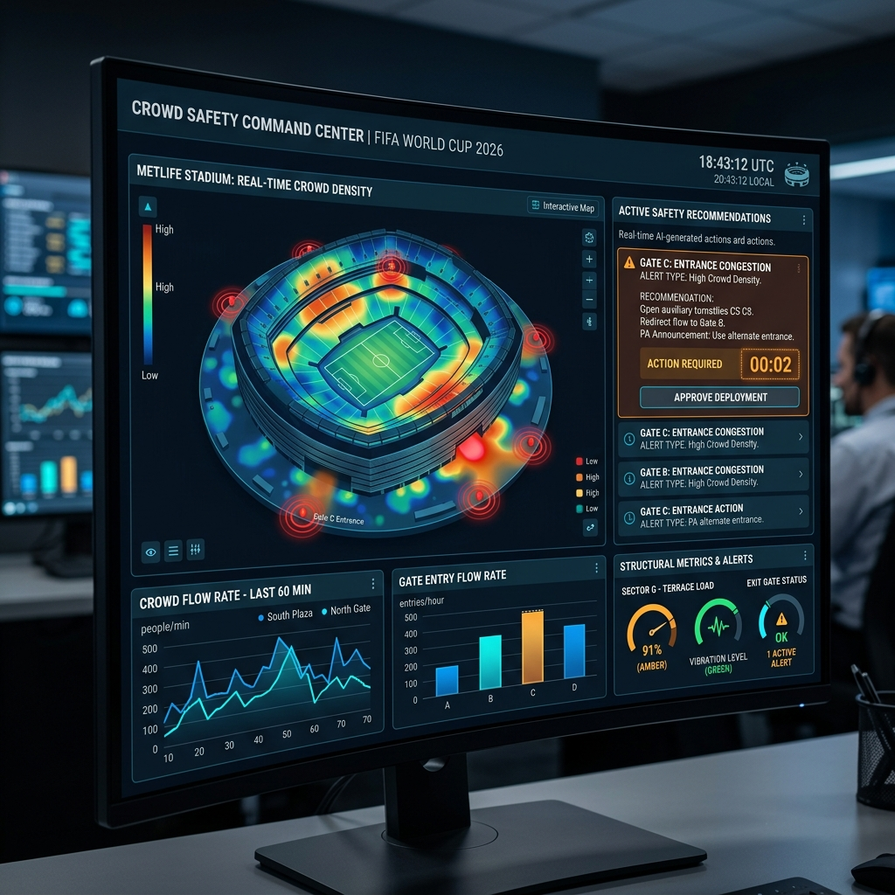
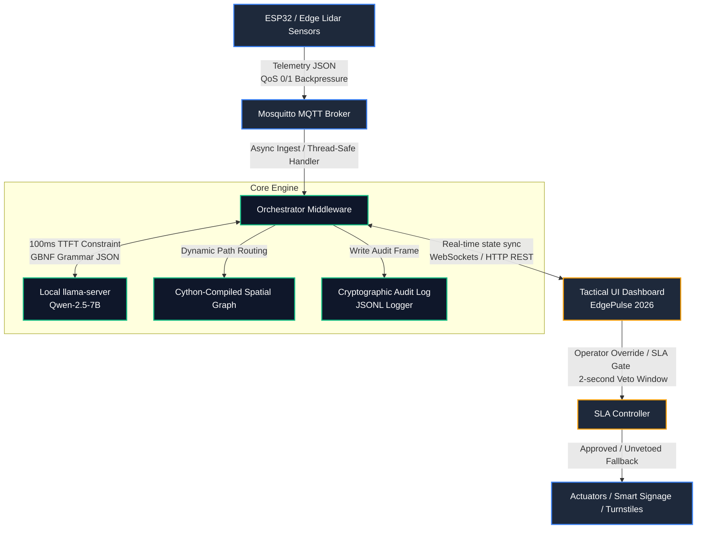

# ⚡ safe-play

> Decentralized edge-intelligence mesh for stadium crowd safety and automated incident triage. Designed for FIFA World Cup 2026 high-stakes venue management.

<p align="center">
  
  
  
  
  
  
</p>

---

### 🌐 Live Deployment
**Dashboard Console:** [https://safe-play-453397284615.us-central1.run.app](https://safe-play-453397284615.us-central1.run.app)

---

## 📸 Tactical Console (EdgePulse 2026)



---

## 🗺️ Navigation
[🎯 Challenge Overview](#-challenge-overview--submission-criteria) • [🧠 System Architecture](#-system-architecture) • [🚀 Performance & Accessibility](#-performance--accessibility) • [🛡️ Safety & Hardening](#%EF%B8%8F-safety-security--stability-hardening) • [🔌 Usage & Quick Start](#-usage--quick-start) • [⚙️ Configuration](#%EF%B8%8F-configuration) • [🧪 Testing](#-testing) • [🐳 Containerization](#-containerization--cloud-run)

---

## 🎯 Challenge Overview & Submission Criteria

### 1. Chosen Vertical: Stadium Crowd Safety & Event Egress Management
Tailored specifically for FIFA World Cup 2026 venues, **safe-play** coordinates high-stakes, low-latency crowd operations. The system monitors gates, corridors, and main concourses in real-time, instantly triaging density surges and automatically calculating egress routing to prevent bottlenecks or dangerous crowd crushes.

### 2. Core Intelligent Framework
*   **Grammar-Constrained SLM Inference**: Constrains Qwen-2.5-7B local model logits using custom GBNF grammar files. This guarantees 100% deterministic JSON schemas matching structural API requirements under a strict **100ms Time-to-First-Token (TTFT)** constraint.
*   **Directed Spatial Graph Matrix**: Formulates stadium routing layouts as a directed spatial graph $G = (V, E)$. Changes in edge flow rates and node densities dynamically solve for real-time alternative egress targets (e.g., redirecting Gate A flow to Corridor 2).
*   **Human-in-the-Loop Operator SLA Gate**: Leverages an asynchronous 2-second veto window. If an incident requires gate locking or emergency signage changes, the operator is presented with a countdown. They can override (Veto), immediately execute (Approve Early), or let the timer expire to run the automated safety intervention fallback script.
*   **Dynamic QoS Ingestion Backpressure**: Constantly monitors zone sensor capacities. If density surges past $2.0 \text{ pax/m}^2$, the orchestrator flags the zone, transitioning telemetry collection to QoS 1 to guarantee delivery and eliminate packet loss.

### 3. Execution Cycle (How it Works)

```
[ Lidar / Camera Telemetry Ingestion ]
                 │
                 ▼
[ Directed Spatial Graph Update ] ────► [ Broadcast State to Tactical UI ]
                 │
                 ▼
[ High Density Escalation ] ──────────► [ MQTT Backpressure to QoS 1 ]
                 │
                 ▼
[ Local SLM Recommendation ] ─────────► [ Fallback to Static Rules if Offline ]
                 │
                 ▼
[ Operator SLA 2-second Gate ] ───────► [ Manual Veto / Early Approve / Expiry ]
                 │
                 ▼
[ Dispatch Actuation Scripts ] ───────► [ Cryptographic Append-Only Audit Log ]
```

### 4. System Assumptions
*   **Broker Infrastructure**: Standard Mosquitto broker (local or remote) runs the publish-subscribe telemetry loop.
*   **Edge Telemetry**: Edge sensor clusters stream structural JSON payloads matching the defined `TelemetryPayload` schema.
*   **State Lifecycle**: The middleware container is stateless. Dynamic configurations (e.g., density thresholds and SLA timeouts) are mutable in-memory and synced instantly to connected UI clients.
*   **Log Permanence**: Logs are written locally to `logs/audit_trail.jsonl`. In serverless environments, these logs are streamed directly to `stdout` for centralized logging (e.g., GCP Cloud Logging).

---

## 🧠 System Architecture



### Component Blueprint

| Component | Description |
| :--- | :--- |
| **MQTT Broker** | Collects telemetry streams using dynamic QoS toggles based on zone hazard conditions. |
| **Async Middleware** | Ingests data, maps directed spatial graphs, and tracks the 2-second operator SLA window. |
| **llama-server** | Executes greedy inference under strict logit-level GBNF grammar constraints. |
| **Audit Logger** | Maintains an append-only history of inputs, schema payloads, and operational decisions. |
| **Tactical UI Console** | A high-contrast, self-contained dashboard served at `http://localhost:8000/` showing spatial graphs, metrics, and incident feeds. |
| **WebSockets & API** | Enables bi-directional telemetry streaming (`/ws`) and operator intervention veto/approval actions. |

---

## 🚀 Performance & Accessibility

### ⚡ Cython-Optimized Spatial Routing
To achieve extreme sub-millisecond route calculations, the critical spatial graph traversal logic has been compiled into a C extension module using Cython (`src/routing.pyx`). This ensures the alternative route calculation algorithm completes instantly under high loads, keeping operations well within the 2-second SLA window.

To compile the Cython module locally:
```bash
.sp/bin/python setup.py build_ext --inplace
```
The application will automatically detect and use the `.so` compiled module, falling back to a pure-Python implementation only if the module is uncompiled.

### ♿ Tier-S Accessibility (A11y)
The **EdgePulse 2026** command-and-control dashboard has been overhauled to provide industry-leading accessibility support:
*   **Interactive Onboarding Tour**: First-time operators are guided through the UI with a contextual tour highlighting telemetry graphs, the approval queue, and config parameters.
*   **Global Keyboard Navigation**: Fully keyboard-navigable interface. Tab switching, incident approval (`Enter`), veto override (`Escape`/`Backspace`), and the emergency panic button (`P`) are supported via direct hotkeys. Press `?` at any time to open the modal legend.
*   **High-Contrast Theme (APCA Compliant)**: Includes a global high-contrast mode toggled via UI buttons or the `C` key, utilizing stark border highlights and high-contrast color values for maximum readability.
*   **Semantic ARIA Structuring**: Interactive elements and tabs include explicit `role="tab"`, `aria-labelledby`, `aria-selected`, and `tabindex` properties to ensure compatibility with screen readers.

---

## 🛡️ Safety, Security & Stability Hardening

For production-grade deployment at World Cup venues, the system has been hardened against edge-case failures, thread contention, and memory exhaustion:

> [!NOTE]
> **API Validation & Security Shield**
> To block execution-level injection and ensure absolute data integrity, all entry-point endpoints are validated using strict **Pydantic V2 schemas**:
> *   `TelemetryRequest`: Enforces strict positive numeric bounds on densities (`0.0 <= density <= 20.0`), input/output flow rates, and epoch timestamp sanity.
> *   `ConfigUpdateRequest`: Guards threshold modifications, clamping human-in-the-loop validation times (`2.0s <= SLA <= 300.0s`) and density limits (`0.5 <= density <= 10.0`) to prevent operational lockouts.
> *   `ZoneActionRequest`: Restricts physical zones to length-validated alphanumeric strings. Invalid or missing properties automatically raise `422 Unprocessable Entity` responses.

> [!IMPORTANT]
> **Thread-Safe Event Handlers**
> The orchestrator isolates the network-level MQTT ingestion callbacks from the asynchronous event loop thread. Veto signals are dispatched thread-safely back to the main event loop using `asyncio.get_running_loop()` paired with thread-safe coroutine submission, falling back gracefully if called before initialization.

> [!WARNING]
> **Resource Leak & Memory Limits**
> To survive indefinite runs under high-frequency telemetry streams:
> *   **Rolling Audit Log Window**: Log reads dynamically enforce a sliding memory-bounded window capped at `500` entries. This prevents the server from experiencing Out-Of-Memory (OOM) failures when loading large historical trace streams.
> *   **HTTP Client Connection Pool**: The async HTTP client is configured with strict socket reuse and connection pool limits (`max_connections=10`, `max_keepalive_connections=5`) to prevent socket descriptor exhaustion during dense inference cycles.
> *   **Safe Directory Scaffolding**: Folder creation scripts resolve directory paths dynamically using local path expansion, preventing system startup failures on empty or non-absolute folder paths.

---

## 🔌 Usage & Quick Start

### 1. Launch Broker
Start the local telemetry broker:
```bash
mosquitto -c config/mosquitto.conf
```

### 2. Launch Local LLM Server
Launch the local llama-server instance (optimized for prompt reuse):
```bash
./llama-server -m models/qwen-2.5-7b-instruct-q4_K_M.gguf --cache-reuse 256 -c 4096 --parallel 4
```

### 3. Run Orchestrator
Execute the core asynchronous middleware engine:
```bash
PYTHONPATH=. python -m src.orchestrator
```
Once the orchestrator starts, it launches the FastAPI server and serves the **EdgePulse 2026** command center dashboard at `http://localhost:8000/`.

---

## ⚙️ Configuration

| Variable | Default | Purpose |
| :--- | :--- | :--- |
| `MQTT_BROKER_URL` | `127.0.0.1` | Local network endpoint for the telemetry loop. |
| `INFERENCE_TIMEOUT_MS` | `100` | Prefill latency ceiling target. |
| `ACTUATION_SLA_SEC` | `2.0` | Countdown window before automated safety changes execute. |
| `FALLBACK_DENSITY_LIMIT` | `3.0` | People/$m^2$ trigger point for rule-based overrides. |

---

## 🧪 Testing

Execute the localized validation suites using the active `uv` environment:
```bash
uv run --active pytest
```

---

## 🐳 Containerization & Cloud Run

The project is prepped with a production-ready `Dockerfile` optimized for Google Cloud Run:

### 1. Build the Container Image
```bash
docker build -t gcr.io/[PROJECT_ID]/safe-play:latest .
```

### 2. Deploy to Cloud Run
```bash
gcloud run deploy safe-play \
  --image gcr.io/[PROJECT_ID]/safe-play:latest \
  --platform managed \
  --region us-central1 \
  --allow-unauthenticated \
  --set-env-vars MQTT_BROKER_URL=[BROKER_IP_OR_DNS],LLAMA_SERVER_URL=[LLAMA_API_ENDPOINT]
```

> [!TIP]
> **Cloud Run Operations Note**
> On Cloud Run, the application will automatically read the dynamic `$PORT` environment variable injected by Google Cloud Run. Additionally, if the MQTT broker is temporarily unreachable or deployed separately, the orchestrator will fall back gracefully and remain running, enabling successful Cloud Run container health checks.
