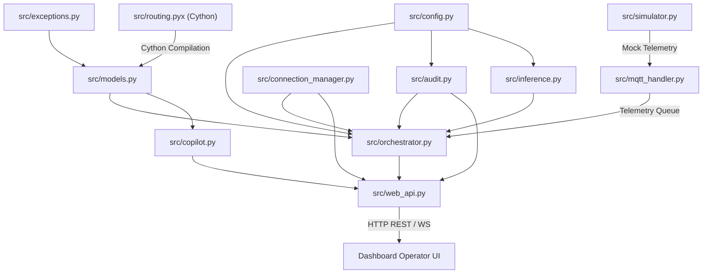

# SafePlay Orchestrator Architecture
**Version 1.0.0** · SafePlay Core Team · 2026-07-18 · [metadata: offline-first, crowd-safety, fifa-2026]

---

## AI READING INSTRUCTION

Read `[SPEC]` and `[BUG]` blocks for authoritative facts, structural requirements, and integration logic.
Read `[NOTE]` only if additional human-focused context, engineering philosophy, or design rationale is needed.
`[?]` blocks are unverified hypotheses.

---

## 1. System Overview

**[SPEC]**
*   **Purpose**: SafePlay is an offline-first crowd-safety orchestration mesh designed to manage egress logistics across FIFA World Cup 2026 stadiums.
*   **Core SLA Requirements**:
    *   **Sub-100ms Latency**: All local route computations and local SLM prompt completions must maintain a latency profile below 100 milliseconds.
    *   **Human Sovereignty**: 2-second countdown window is enforced for all safety interventions, enabling operator vetoes before physical signs or gate controls actuate.
    *   **Deterministic Safety**: If any LLM/SLM completion fails to parse against the dynamic Pydantic schema, the orchestrator immediately falls back to static threshold-based safety rules.
    *   **Verifiable Audit Ledger**: All telemetry surges, override decisions, and configuration modifications are saved to a cryptographically linked, append-only JSONL log.

**[NOTE]**
SafePlay is engineered to operate under degraded conditions, such as stadium network blackouts or cloud backhaul outages. It relies on a local MQTT broker and local GBNF grammar-constrained llama-server instances to maintain full operational intelligence without external internet connectivity.

---

## 2. Structural Dependencies & Data Flow

**[SPEC]**
The diagram below maps the runtime dependencies and directional data flow among the Python/Cython modules of the SafePlay framework:



---

## 3. Component-by-Component Blueprint

**[SPEC]**

The system consists of the following modules, categorized by their position in the system layers:

| Module | Core Role | Direct Dependencies | Inter-Component Communication |
| :--- | :--- | :--- | :--- |
| `src/config.py` | Governance settings, timeouts, keys, and logging setup. | Built-in `os`, `sys`, `logging` | Exposes global constants to all files. |
| `src/exceptions.py` | Platform-wide exceptions defining error boundaries. | None | Imported by models, orchestrator, and web API. |
| `src/models.py` | Pydantic validation schemas & physical spatial graph state. | `src/exceptions.py`, `src/routing.pyx` | Models structure telemetry inputs and intervention outputs. |
| `src/routing.pyx` | Cython-accelerated A*/BFS graph routing. | None (pure C types) | Imported inside `src/models.py` to optimize pathfinding. |
| `src/audit.py` | Cryptographically chained append-only JSONL logger. | `src/config.py` | Exposes `write_audit_log` and `verify_audit_trail`. |
| `src/connection_manager.py` | Asynchronous WebSocket connection registry & broadcast. | FastAPI WebSocket | Maintained by `web_api.py` and invoked by the orchestrator. |
| `src/inference.py` | Grammar-constrained SLM / Gemini client. | `src/config.py`, `src/models.py` | Parses telemetry into JSON matching the schema. |
| `src/mqtt_handler.py` | Thread-safe MQTT client wrapper with dynamic QoS logic. | `paho.mqtt` | Dispatches raw sensor updates to the orchestrator queue. |
| `src/copilot.py` | Natural language query assistant using Gemini/SOPs. | `src/models.py`, `src/config.py` | Processes operator support questions via `web_api.py`. |
| `src/simulator.py` | High-frequency telemetry stress generator. | `src/mqtt_handler.py` | Simulates crowd spikes over localhost MQTT broker. |
| `src/web_api.py` | FastAPI server definition & API routing. | `src/models.py`, `src/copilot.py` | Exposes REST endpoints and coordinates with `ConnectionManager`. |
| `src/orchestrator.py` | Central lifecycle loop, veto clock, and coordination engine. | All modules except `src/copilot.py` | Integrates MQTT queues, triggers SLMs, and broadcasts WebSocket states. |

### Detailed Module Behaviors

*   **`src/config.py`**
    *   *Input*: Environment variables (`GEMINI_API_KEY`, `TELEMETRY_SECRET_KEY`).
    *   *Output*: Immutable configuration objects and initialized `logger` handlers.
*   **`src/exceptions.py`**
    *   *Role*: Standardizes exceptions such as `TelemetryValidationError`, `InferenceTimeoutError`, and `OperatorActionError`.
*   **`src/models.py`**
    *   *Role*: Validates schema constraints (e.g. `TelemetryPayload` signature verification using HMAC-SHA256).
    *   *Graph Logic*: Generates `SpatialGraph.get_default_world_cup_graph()` containing 8 interconnected nodes representing World Cup vomitories.
*   **`src/routing.pyx`**
    *   *Optimizations*: Disables bounds checking and negative index wrapping (`boundscheck=False`, `wraparound=False`). Uses static C-types (`cdef double`, `cdef list queue`) to complete traversals in $<100\mu s$.
*   **`src/audit.py`**
    *   *Cryptographic Chaining*: Each JSONL entry records the `prev_hash` of the preceding line. Writes use `O(1)` memory by seeking directly to the end of the file to verify the last hash.
*   **`src/connection_manager.py`**
    *   *Concurrency*: Uses `asyncio.gather` to push state changes to all WebSocket terminals concurrently, wrapping client writes with a 1.0-second timeout.
*   **`src/inference.py`**
    *   *Constrained Schema*: Formulates prompting templates requiring JSON schemas to prevent hallucinated keys.
*   **`src/mqtt_handler.py`**
    *   *Thread Safety*: Paho MQTT callbacks execute in a background C thread; the handler uses `loop.call_soon_threadsafe` to push inbound packets onto the orchestrator's `asyncio.Queue` thread-safely.
*   **`src/copilot.py`**
    *   *Context Integration*: Compiles FIFA 2026 SOP instructions and merges them with live zone density metrics before executing LLM requests.
*   **`src/orchestrator.py`**
    *   *Lifecycle*: Continuously polls `self.telemetry_queue`. Updates spatial nodes, executes LLM inference or fallbacks, triggers a 2-second veto countdown task, and writes output outcomes to the cryptographic audit ledger.

---

## 4. Core Communication Workflows

### 4.1 Telemetry Ingestion Flow

**[SPEC]**
```
[Sensor/Turnstile] --(QoS 0/1 MQTT)--> [mqtt_handler.py] --(asyncio.Queue)--> [orchestrator.py]
                                                                                      |
                                                                              [models.py (HMAC)]
                                                                                      |
                                                                             (Updates Graph state)
                                                                                      |
                                                                        [connection_manager.py]
                                                                                      |
                                                                            (WebSocket Broadcast)
                                                                                      |
                                                                             [Dashboard UI]
```

### 4.2 Intervention Decision & Veto Flow

**[SPEC]**
```
                     (Density > Threshold)
[orchestrator.py] -------------------------> [inference.py (SLM)]
        |                                            |
        |<---(JSON Intervention Script)---------------
        |
        +---> [orchestrator.py (Create Veto Task)]
        |                 |
        |         (Start 2s Timer)
        |                 |
        |                 v
        |        [WebSocket Broadcast] ----> [Dashboard UI (Operator Panel)]
        |                                                 |
        |                                      (Operator Veto/Approve click)
        |                                                 |
        |<---(REST POST Veto/Approve)---------------------+
        |
  [Veto Task Evaluated]
        |
        +---> If Vetoed: Mark Cancelled -> Write Audit Log (Vetoed) -> Abort Actuation.
        +---> If Approved/Timer Expiry: Actuate Signage/Gates -> Write Audit Log (Actuated).
```

---

## 5. Known Failure Modes & Engineering Mitigations

**[BUG] VRAM Contention & Token Crawl**
*   **Symptom**: Local `llama-server` response latency rises above 2 seconds, triggering the orchestrator's `InferenceTimeoutError`.
*   **Cause**: Concurrent request slots fighting for GPU/CPU cache lines under heavy multi-camera simulator load.
*   **Fix**: Configure the server with `--parallel 2 --cache-reuse 256 --no-kv-unified` to enforce static prompt caching allocations.

**[BUG] Concurrent WebSocket Mutex Collision**
*   **Symptom**: WebSocket state broadcasts freeze or raise `RuntimeError: dictionary changed size during iteration`.
*   **Cause**: Fast-disconnecting clients modifying `active_connections` list while a broadcast gather is traversing it.
*   **Fix**: Wrap active connections with a local shallow copy `connections = list(self.active_connections)` before traversing.

**[BUG] Cython Import Failure Fallback**
*   **Symptom**: System fails to boot on machines missing a C compiler toolchain.
*   **Cause**: Strict import of the `.so` binary resulting in `ImportError`.
*   **Fix**: Implemented exception wrapping around the Cython routing import inside `src/models.py`. If compilation is missing, it dynamically binds to an identical pure-Python routing fallback logic.

---

## 6. Document Changelog

**[SPEC]**
*   **Version 1.0.0 (2026-07-18)**: Initial release of the architectural documentation under the HADS specification, detailing component behaviors, structural dependencies, and failure mitigations.
